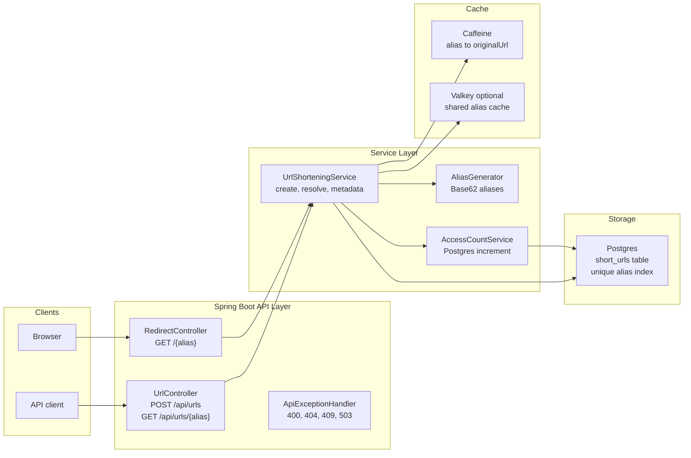
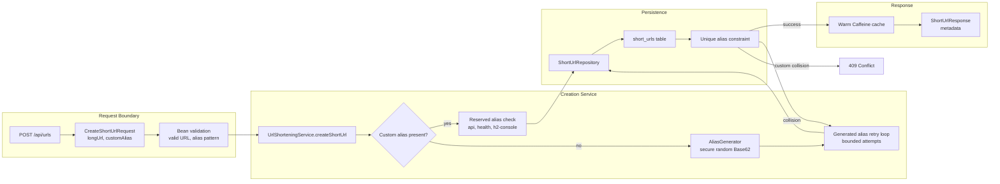
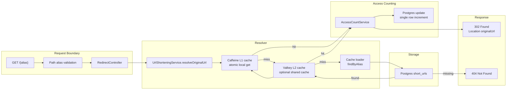
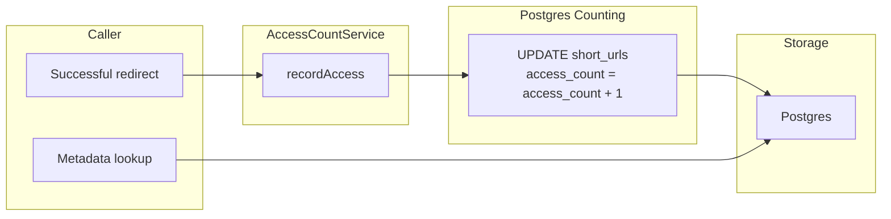
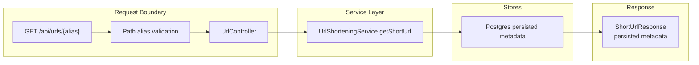

# ZipURL

Initial Spring Boot setup for the ZipURL service.

## Architecture

### High-Level System



Low-level details:

- `POST /api/urls` creates aliases and persists canonical URL state in Postgres.
- `GET /{alias}` resolves aliases through Caffeine plus Postgres and records access counts.
- `GET /api/urls/{alias}` reads metadata from Postgres.
- Postgres remains the source of truth for aliases, original URLs, creation time, and persisted access counts.
- Caffeine is the local read cache for redirects.
- Valkey can be enabled as an optional shared L2 cache for alias-to-original-URL entries.

### Creation Flow



Low-level details:

- `CreateShortUrlRequest.longUrl` must be a valid URL.
- `customAlias` is optional and limited to letters, numbers, `_`, and `-`.
- `ttlSeconds` is optional (must be `>= 1`); when set, the link expires that many seconds after creation and resolves/metadata return `404` once expired.
- The app does a fast `existsByAlias` check for custom aliases, but the Postgres unique constraint is the real race-condition guard.
- Generated alias collisions are retried with a fresh alias.
- Custom alias collisions return `409 Conflict`.

### Redirect Flow



Low-level details:

- Caffeine uses atomic local loading, which avoids many same-instance concurrent requests stampeding Postgres for the same hot alias.
- Valkey can be used as a shared L2 cache across app instances; Postgres remains the source of truth.
- Redirects return only `302` plus the `Location` header. Metadata is available through the API endpoint instead.
- If the alias disappears from Postgres while still cached, the access-count service can reject the update and the local cache entry is invalidated.

### Access Count Flow



Low-level details:

- Every successful redirect performs an atomic Postgres increment.
- This is the simplest correct counting model and avoids buffered-counter loss windows.
- Metadata reads the persisted Postgres count.
- If redirect traffic grows enough that this becomes a write bottleneck, move counting to a durable event stream rather than a lossy cache buffer.

### Metadata Flow



Low-level details:

- Metadata lookup does not redirect and does not increment `accessCount`.
- The response includes `alias`, `shortUrl`, `originalUrl`, `createdAt`, and `accessCount`.
- `accessCount` is the persisted Postgres count.

## API

- `POST /api/urls` creates a short URL. `longUrl` must be a valid URL; `customAlias` and `ttlSeconds` (link lifetime in seconds) are optional. The response includes `expiresAt` (null when no TTL was set).
- `GET /{alias}` redirects to the original URL and increments `accessCount`.
- `GET /api/urls/{alias}` returns metadata without incrementing `accessCount`.

## Requirements

- Java 21
- Maven 3.9+

## Run

```bash
mvn spring-boot:run
```

## Run With DigitalOcean Postgres

```bash
export ZIPURL_DB_PASSWORD='<database-password>'
export ZIPURL_VALKEY_PASSWORD='<valkey-password>'
SPRING_PROFILES_ACTIVE=postgres mvn spring-boot:run
```

The `postgres` profile uses:

- Host: `zipurl-do-user-39324437-0.a.db.ondigitalocean.com`
- Port: `25060`
- Database: `defaultdb`
- Username: `doadmin`
- SSL mode: `require`

The Docker image defaults to `SPRING_PROFILES_ACTIVE=postgres` so DigitalOcean App Platform uses the shared Postgres database instead of per-instance H2. Set these App Platform environment variables before deploying:

- `ZIPURL_DB_PASSWORD`
- `ZIPURL_VALKEY_PASSWORD`

Valkey shared URL cache uses:

- Host: `zipurl-valkey-do-user-39324437-0.a.db.ondigitalocean.com`
- Port: `25061`
- Username: `default`
- SSL: enabled

Set `ZIPURL_URL_CACHE_MODE=local` to bypass Valkey and use only in-process Caffeine caching.


## Test

```bash
mvn test
```

## Deployed Integration Tests

The deployed integration tests default to `https://goldfish-app-gvvnj.ondigitalocean.app/health`.

```bash
mvn -Dzipurl.runDeployedIntegrationTests=true -Dtest=DeployedAppIntegrationTests test
```

Override the deployed target with:

```bash
ZIPURL_INTEGRATION_BASE_URL='https://your-app.example.com' \
  mvn -Dzipurl.runDeployedIntegrationTests=true -Dtest=DeployedAppIntegrationTests test
```

## Health Check

```bash
curl http://localhost:8080/health
```
