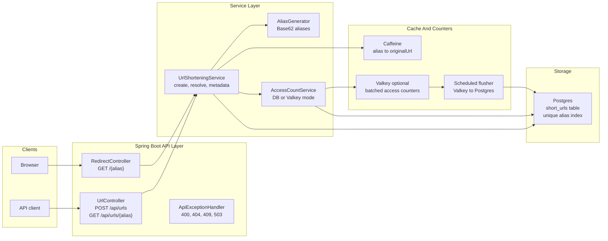
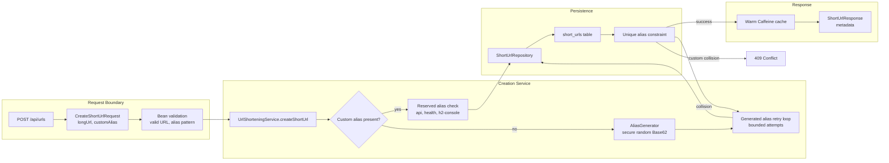
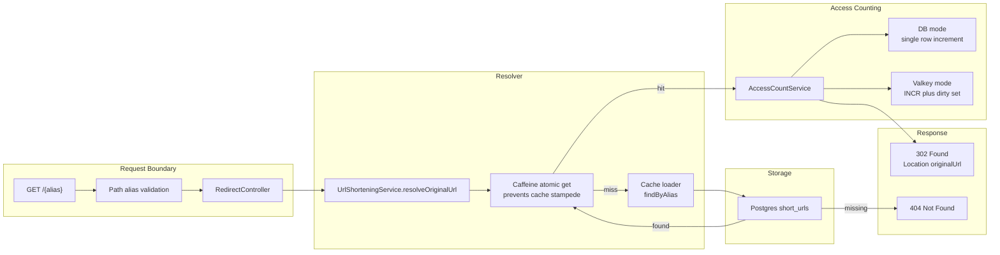
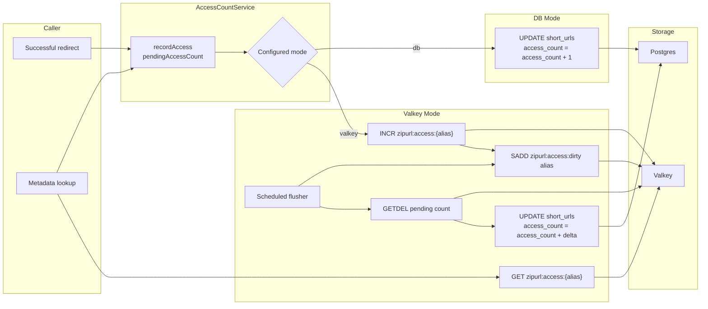
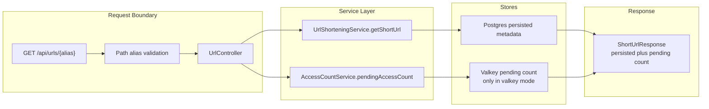

# ZipURL

Initial Spring Boot setup for the ZipURL service.

## Architecture

### High-Level System



Low-level details:

- `POST /api/urls` creates aliases and persists canonical URL state in Postgres.
- `GET /{alias}` resolves aliases through Caffeine plus Postgres and records access counts.
- `GET /api/urls/{alias}` reads metadata from Postgres and adds pending Valkey counts when Valkey mode is enabled.
- Postgres remains the source of truth for aliases, original URLs, creation time, and persisted access counts.
- Valkey is an optional write buffer for access counts, not the canonical URL store.

### Creation Flow



Low-level details:

- `CreateShortUrlRequest.longUrl` must be a valid URL.
- `customAlias` is optional and limited to letters, numbers, `_`, and `-`.
- The app does a fast `existsByAlias` check for custom aliases, but the Postgres unique constraint is the real race-condition guard.
- Generated alias collisions are retried with a fresh alias.
- Custom alias collisions return `409 Conflict`.

### Redirect Flow



Low-level details:

- Caffeine uses atomic loading for cache misses, which avoids many concurrent requests stampeding Postgres for the same hot alias.
- Redirects return only `302` plus the `Location` header. Metadata is available through the API endpoint instead.
- If the alias disappears from Postgres while still cached, the access-count service can reject the update and the local cache entry is invalidated.

### Access Count Flow



Low-level details:

- Default mode is `db`, which writes every redirect count directly to Postgres.
- `valkey` mode reduces redirect-time database writes by buffering counts in Valkey.
- Metadata returns persisted Postgres count plus pending Valkey count.
- Valkey batching is eventually consistent. If counts become billing-critical or must be lossless, use direct DB writes or a durable event stream.
- Current Valkey keys:
  - `zipurl:access:{alias}` stores the pending count.
  - `zipurl:access:dirty` stores aliases with pending counts.

### Metadata Flow



Low-level details:

- Metadata lookup does not redirect and does not increment `accessCount`.
- The response includes `alias`, `shortUrl`, `originalUrl`, `createdAt`, and `accessCount`.
- In Valkey mode, `accessCount` includes both flushed and unflushed counts.

## API

- `POST /api/urls` creates a short URL. `longUrl` must be a valid URL; `customAlias` is optional.
- `GET /{alias}` redirects to the original URL and increments `accessCount`.
- `GET /api/urls/{alias}` returns metadata without incrementing `accessCount`.

## Requirements

- Java 21
- Maven 3.9+

## Run

```bash
mvn spring-boot:run
```

## Run With DigitalOcean Postgres

```bash
export ZIPURL_DB_PASSWORD='<database-password>'
export ZIPURL_VALKEY_PASSWORD='<valkey-password>'
SPRING_PROFILES_ACTIVE=postgres mvn spring-boot:run
```

The `postgres` profile uses:

- Host: `zipurl-do-user-39324437-0.a.db.ondigitalocean.com`
- Port: `25060`
- Database: `defaultdb`
- Username: `doadmin`
- SSL mode: `require`

Valkey access-count batching uses:

- Host: `zipurl-valkey-do-user-39324437-0.a.db.ondigitalocean.com`
- Port: `25061`
- Username: `default`
- SSL: enabled

Set `ZIPURL_ACCESS_COUNT_MODE=db` to bypass Valkey and write access counts directly to Postgres.

## Test

```bash
mvn test
```

## Health Check

```bash
curl http://localhost:8080/health
```
