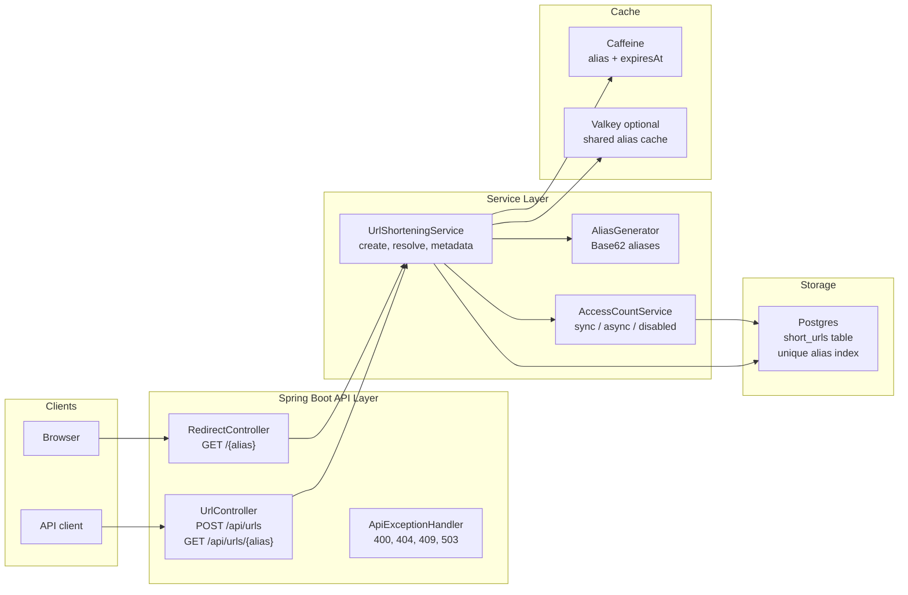
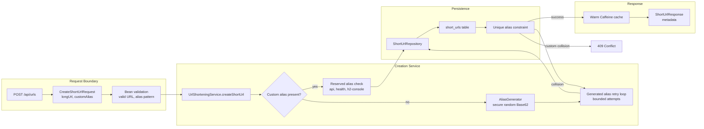
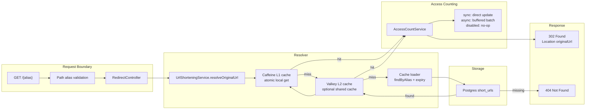
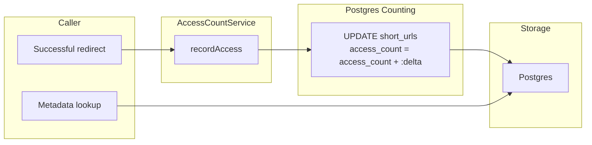
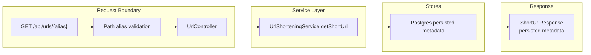

# ZipURL

Initial Spring Boot setup for the ZipURL service.

## Architecture

### High-Level System



Low-level details:

- `POST /api/urls` creates aliases and persists canonical URL state in Postgres.
- `GET /{alias}` resolves aliases through Caffeine/Valkey/Postgres, validates expiry, and records access counts according to the configured mode.
- `GET /api/urls/{alias}` reads metadata from Postgres.
- Postgres remains the source of truth for aliases, original URLs, creation time, and persisted access counts.
- Caffeine is the local read cache for redirects.
- Valkey can be enabled as an optional shared L2 cache for alias-to-original-URL plus expiry entries.

### Creation Flow



Low-level details:

- `CreateShortUrlRequest.longUrl` must be a valid URL.
- `customAlias` is optional and limited to letters, numbers, `_`, and `-`.
- `ttlSeconds` is optional (must be `>= 1`); when set, the link expires that many seconds after creation and resolves/metadata return `404` once expired.
- The app does a fast `existsByAlias` check for custom aliases, but the Postgres unique constraint is the real race-condition guard.
- Generated alias collisions are retried with a fresh alias.
- Custom alias collisions return `409 Conflict`.

### Redirect Flow



Low-level details:

- Caffeine uses atomic local loading, which avoids many same-instance concurrent requests stampeding Postgres for the same hot alias.
- Valkey can be used as a shared L2 cache across app instances; Postgres remains the source of truth.
- Redirects return only `302` plus the `Location` header. Metadata is available through the API endpoint instead.
- Cached redirect entries include `expiresAt`, so redirects can reject expired aliases even when the original URL is already cached.
- In `sync` mode the app still performs a direct expiry-aware Postgres increment.
- In `async` mode redirects only increment an in-memory `LongAdder` and a scheduled flusher writes batched deltas back to Postgres.
- In `disabled` mode redirects skip counting entirely.

### Access Count Flow



Low-level details:

- `sync` mode performs an atomic Postgres increment on every redirect.
- `async` mode batches counts by alias in memory and flushes them on a timer.
- `disabled` mode skips access counting completely.
- Metadata continues to read the persisted Postgres count.
- Use `async` for production. One redirect per Postgres write does not scale to high RPS, and 1M RPS cannot be served by a single row update per request.
- Batched writes must be grouped by alias so repeated redirects collapse into one `UPDATE ... SET access_count = access_count + :delta`.

### Metadata Flow



Low-level details:

- Metadata lookup does not redirect and does not increment `accessCount`.
- The response includes `alias`, `shortUrl`, `originalUrl`, `createdAt`, and `accessCount`.
- `accessCount` is the persisted Postgres count.

## API

- `POST /api/urls` creates a short URL. `longUrl` must be a valid URL; `customAlias` and `ttlSeconds` (link lifetime in seconds) are optional. The response includes `expiresAt` (null when no TTL was set).
- `GET /{alias}` redirects to the original URL and increments `accessCount`.
- `GET /api/urls/{alias}` returns metadata without incrementing `accessCount`.

## Access Count Modes

- `sync`: direct Postgres increment on every redirect, useful when you want the simplest correctness-first behavior.
- `async`: production default. Redirects increment an in-memory `LongAdder`, then a scheduled flusher batches deltas by alias and writes them to Postgres.
- `disabled`: skips counting entirely for extreme-load tests or temporary hot-path validation.

Recommendation: keep `disabled` in production for now if you want the write-free redirect hot path. Enable `async` only after verifying the async flusher and Postgres headroom on your deployment.

## Requirements

- Java 21
- Maven 3.9+

## Run

```bash
mvn spring-boot:run
```

## Run With DigitalOcean Postgres

```bash
export ZIPURL_DB_PASSWORD='<database-password>'
export ZIPURL_VALKEY_PASSWORD='<valkey-password>'
SPRING_PROFILES_ACTIVE=postgres ZIPURL_DB_MAX_POOL=10 mvn spring-boot:run
```

The `postgres` profile uses:

- Host: `zipurl-do-user-39324437-0.a.db.ondigitalocean.com`
- Port: `25060`
- Database: `defaultdb`
- Username: `doadmin`
- SSL mode: `require`

The Docker image defaults to `SPRING_PROFILES_ACTIVE=postgres` so DigitalOcean App Platform uses the shared Postgres database instead of per-instance H2. Set these App Platform environment variables before deploying:

- `ZIPURL_DB_PASSWORD`
- `ZIPURL_VALKEY_PASSWORD`
- `ZIPURL_DB_MAX_POOL=10`
- `ZIPURL_DB_MIN_IDLE=0`
- `ZIPURL_DB_CONNECTION_TIMEOUT=10000`
- `ZIPURL_DB_IDLE_TIMEOUT=30000`
- `ZIPURL_DB_MAX_LIFETIME=300000`
- `ZIPURL_DB_KEEPALIVE=120000`
- `ZIPURL_DB_INIT_FAIL_TIMEOUT=0`
- `ZIPURL_TOMCAT_MAX_THREADS=120`
- `ZIPURL_TOMCAT_MIN_SPARE_THREADS=20`
- `ZIPURL_TOMCAT_ACCEPT_COUNT=500`
- `ZIPURL_TOMCAT_MAX_CONNECTIONS=1500`
- `ZIPURL_CACHE_MAX_SIZE=100000`
- `ZIPURL_CACHE_EXPIRE_AFTER_WRITE_SECONDS=3600`
- `ZIPURL_ACCESS_COUNT_MODE=disabled`
- `ZIPURL_ACCESS_COUNT_FLUSH_INTERVAL_MS=1000`
- `ZIPURL_ACCESS_COUNT_MAX_PENDING_ALIASES=100000`
- `ZIPURL_ACCESS_COUNT_BATCH_SIZE=1000`

Valkey shared URL cache uses:

- Host: `zipurl-valkey-do-user-39324437-0.a.db.ondigitalocean.com`
- Port: `25061`
- Username: `default`
- SSL: enabled

Set `ZIPURL_URL_CACHE_MODE=local` to bypass Valkey and use only in-process Caffeine caching.

### Schema Updates

The `postgres` profile uses `spring.jpa.hibernate.ddl-auto=validate` and `spring.jpa.open-in-view=false`. Production expects the schema to be provisioned explicitly and safely ahead of time.

The H2/local profile still uses `ddl-auto: update` for convenience.

The SQL files in `src/main/resources/db/migration` are not applied by the application during startup.

### Connection Pool Sizing

Managed Postgres has a hard connection cap (DigitalOcean reserves several slots for superuser/maintenance), so the `postgres` profile keeps the pool well below the limit while using more of the available headroom than a tiny default:

| Property | Env var | Default |
| --- | --- | --- |
| `maximum-pool-size` | `ZIPURL_DB_MAX_POOL` | `10` |
| `minimum-idle` | `ZIPURL_DB_MIN_IDLE` | `0` |
| `connection-timeout` | `ZIPURL_DB_CONNECTION_TIMEOUT` | `10000` ms |
| `idle-timeout` | `ZIPURL_DB_IDLE_TIMEOUT` | `30000` ms |
| `max-lifetime` | `ZIPURL_DB_MAX_LIFETIME` | `300000` ms |
| `keepalive-time` | `ZIPURL_DB_KEEPALIVE` | `120000` ms |
| `initialization-fail-timeout` | `ZIPURL_DB_INIT_FAIL_TIMEOUT` | `0` ms |

Budget connections as `app_instances * ZIPURL_DB_MAX_POOL` plus admin/headroom and keep it under the database's limit. For this 47-connection database:

- 2 instances: `ZIPURL_DB_MAX_POOL=10` uses 20 connections and leaves headroom
- 4 instances: `ZIPURL_DB_MAX_POOL=10` uses 40 connections and leaves 7 connections for admin/headroom
- do not raise `ZIPURL_DB_MAX_POOL` above 10 as the default

The startup failure `FATAL: remaining connection slots are reserved for roles with the SUPERUSER attribute` means the database is out of slots: reduce `ZIPURL_DB_MAX_POOL` and/or instance count, terminate leftover connections (`SELECT pg_terminate_backend(pid) FROM pg_stat_activity WHERE datname = 'defaultdb' AND state = 'idle' AND pid <> pg_backend_pid();`), or restart the database.


## Test

```bash
mvn test
```

## Deployed Integration Tests

The deployed integration tests default to `https://goldfish-app-gvvnj.ondigitalocean.app/health`.

```bash
mvn -Dzipurl.runDeployedIntegrationTests=true -Dtest=DeployedAppIntegrationTests test
```

Override the deployed target with:

```bash
ZIPURL_INTEGRATION_BASE_URL='https://your-app.example.com' \
  mvn -Dzipurl.runDeployedIntegrationTests=true -Dtest=DeployedAppIntegrationTests test
```

## Health Check

```bash
curl http://localhost:8080/health
```
