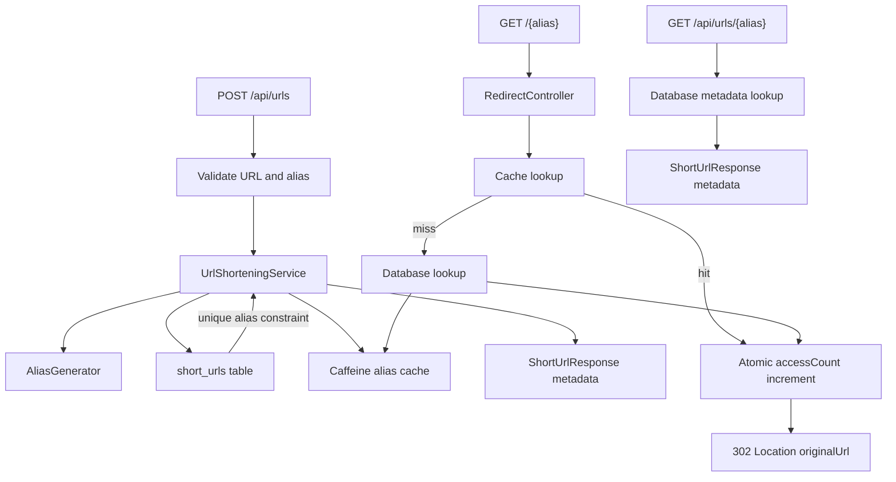

# ZipURL

Initial Spring Boot setup for the ZipURL service.

## Architecture Flow



## API

- `POST /api/urls` creates a short URL. `longUrl` must be `http` or `https`; `customAlias` is optional.
- `GET /{alias}` redirects to the original URL and increments `accessCount`.
- `GET /api/urls/{alias}` returns metadata without incrementing `accessCount`.

## Requirements

- Java 21
- Maven 3.9+

## Run

```bash
mvn spring-boot:run
```

## Test

```bash
mvn test
```

## Health Check

```bash
curl http://localhost:8080/health
```
